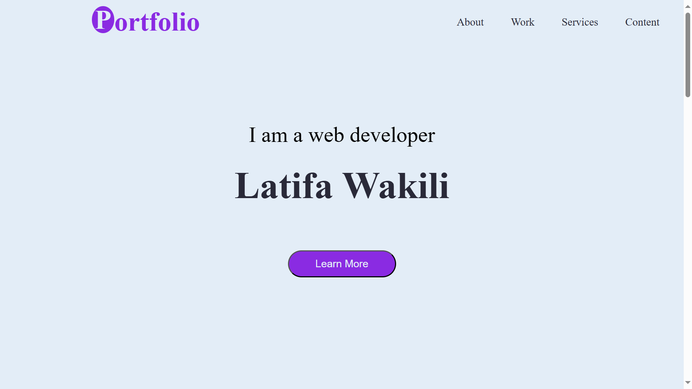

# Project Title 🚀
Portfolio-Webpage
## Project Description 📝

> this project is useful for who work on web devolepment and want to have a Portfolio webpage for thier works
- It can give important and basic info about a web developer.
- whith this project I learned what is a good Portfolio-Webpage and how it is useful.

## Demo 📸




## Technologies Used 🛠️

- HTML
- CSS


## Installation 💻

Provide step-by-step instructions on how to install and set up your project. Include any dependencies or prerequisites that need to be installed.

```bash
# git@github.com:latifa-wakili/Portfolio-Webpage.git
```

```bash
#cd Portfolio-Webpage.
```
```bash
# vscode.
```

## Usage 🎯

```bash
# use git clone .
```

## Features ⭐

Examples:

- navigate in each part you need
- good responsive


## Author 👩‍💻
- Twitter: [@Latifa_Wakili](https://x.com/WakiliLatifa?t=wlHTh8JuyFprQsN_hZQGWQ&s=08)
- LinkedIn: [Latifa Wakili](https://www.linkedin.com/in/latifa-wakili-68423b277?utm_source=share&utm_campaign=share_via&utm_content=profile&utm_medium=android_app)
- Email: [Latifa Wakili](saavenwakili@gmail.com)

## Contributing 🤝
for team working at first you should creat an organization on git hub nex you can creat pull_request on your project to shear whith your team and work on it together.

